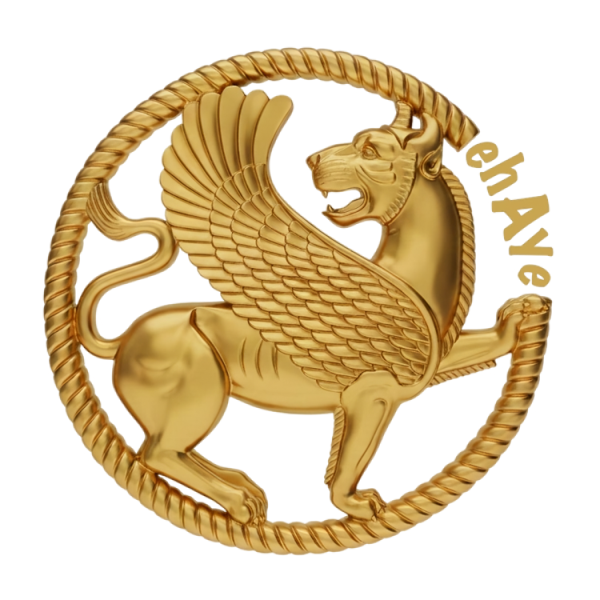
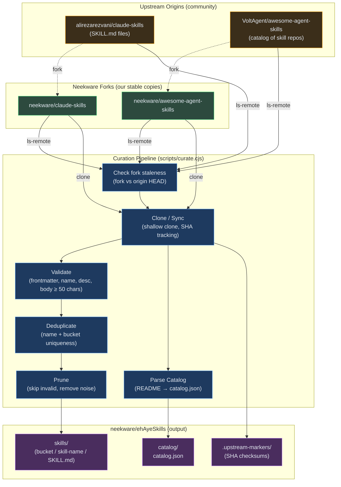

<div align="center">



# ehAyeSkills

### Curated Skills for ehAye Dojo

</div>

Curated, validated skill repository for [ehAye Dojo](https://ehaye.io).

This repo is the **single source of truth** for skills consumed by ehAyeEngine. Rather than pulling
from multiple upstream repos at runtime, we aggregate, validate, deduplicate, and prune skills here
under our control.

## How it works



## Directory structure

```
ehAyeSkills/
├── scripts/
│   ├── curate.cjs           # Main pipeline script
│   └── parse-catalog.cjs    # README → catalog.json parser
├── skills/                   # Curated skill files (bucket/name/SKILL.md)
├── catalog/
│   └── catalog.json          # Parsed catalog of known skill repos
├── .upstream-markers/        # SHA markers tracking last-synced upstream commits
├── .upstream/                # (gitignored) Cloned upstream repos (cache)
├── package.json
└── .gitignore
```

## Usage

### Full sync (check → pull → extract → commit → push)

```bash
node scripts/curate.cjs
```

### Check only (are upstreams ahead? are forks stale?)

```bash
node scripts/curate.cjs --check
```

Exit code 1 if forks are behind origins or if Neekware forks have uncurated changes. Exit code 0 if
everything is current.

### Sync without pushing

```bash
node scripts/curate.cjs --no-push
```

### Using npm scripts

```bash
npm run curate           # full sync + push
npm run curate:check     # check only
npm run curate:local     # sync without push
```

## Adding new upstream sources

Edit the `UPSTREAMS` array in `scripts/curate.cjs`:

```js
const UPSTREAMS = [
  {
    name: 'claude-skills',
    url: 'https://github.com/neekware/claude-skills.git',
    origin: 'https://github.com/alirezarezvani/claude-skills.git',
    type: 'skills',
  },
  {
    name: 'awesome-agent-skills',
    url: 'https://github.com/neekware/awesome-agent-skills.git',
    origin: 'https://github.com/VoltAgent/awesome-agent-skills.git',
    type: 'catalog',
  },
];
```

| Field    | Description                                                          |
| -------- | -------------------------------------------------------------------- |
| `name`   | Local identifier for the upstream                                    |
| `url`    | Neekware fork URL (what we build from)                               |
| `origin` | True upstream URL (what the fork was forked from)                    |
| `type`   | `skills` = contains SKILL.md files; `catalog` = README-based catalog |

## Skill validation rules

A skill is only included if its `SKILL.md`:

- Has YAML frontmatter (`---` delimiters)
- Contains `name:` in frontmatter
- Contains `description:` in frontmatter
- Has at least 50 characters of body content after frontmatter

## License

MIT

## Acknowledgments

This repository aggregates and curates content from the following upstream sources, both licensed
under the **MIT License**:

- **[alirezarezvani/claude-skills](https://github.com/alirezarezvani/claude-skills)** The original
  skill definitions (SKILL.md files, reference docs, and bundled scripts). Forked to
  [neekware/claude-skills](https://github.com/neekware/claude-skills) as our stable working copy.
  Copyright (c) alirezarezvani. MIT License.

- **[VoltAgent/awesome-agent-skills](https://github.com/VoltAgent/awesome-agent-skills)**
  Community-maintained catalog of agent skill repositories, used to generate the
  `catalog/catalog.json` index of known skill sources. Forked to
  [neekware/awesome-agent-skills](https://github.com/neekware/awesome-agent-skills) as our stable
  working copy. Copyright (c) VoltAgent. MIT License.

We gratefully acknowledge the original authors and contributors of these projects. Full license text
for each upstream is available in their respective repositories.
